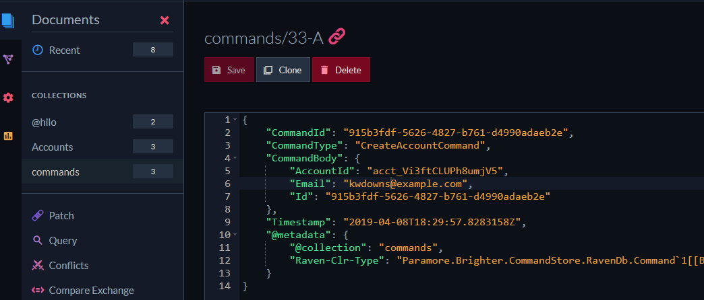

# Paramore.Brighter.CommandStore.RavenDb

## How to use

<https://paramore.readthedocs.io/en/latest/EventSourcing.html#command-or-event-sourcing>

During startup add the command store to the service collection with its own DocumentStore instance.

```csharp
services.AddSingleton<IAmACommandStore>(provider => new RavenDbCommandStore(new DocumentStore
{
    Urls = options.RavenDBOptions.NodeUrls,
    Database = options.RavenDBOptions.DefaultDatabase
}));
services.AddSingleton<IAmACommandStoreAsync>(provider => new RavenDbCommandStore(new DocumentStore
{
    Urls = options.RavenDBOptions.NodeUrls,
    Database = options.RavenDBOptions.DefaultDatabase
}));
```

Then on any command handlers decorate the Handle method with one of the following attributes

```csharp
[UseCommandSourcingAsync(step: 1, timing: HandlerTiming.Before)]


[UseCommandSourcing(step: 1, timing: HandlerTiming.Before)]
```

By default the commands get stored under the `commands` collection, this can be overridden when creating the command store by passing what you want the collection to be named as the second paramter.

`public RavenDbCommandStore(DocumentStore store, string collectionName = "commands")`

